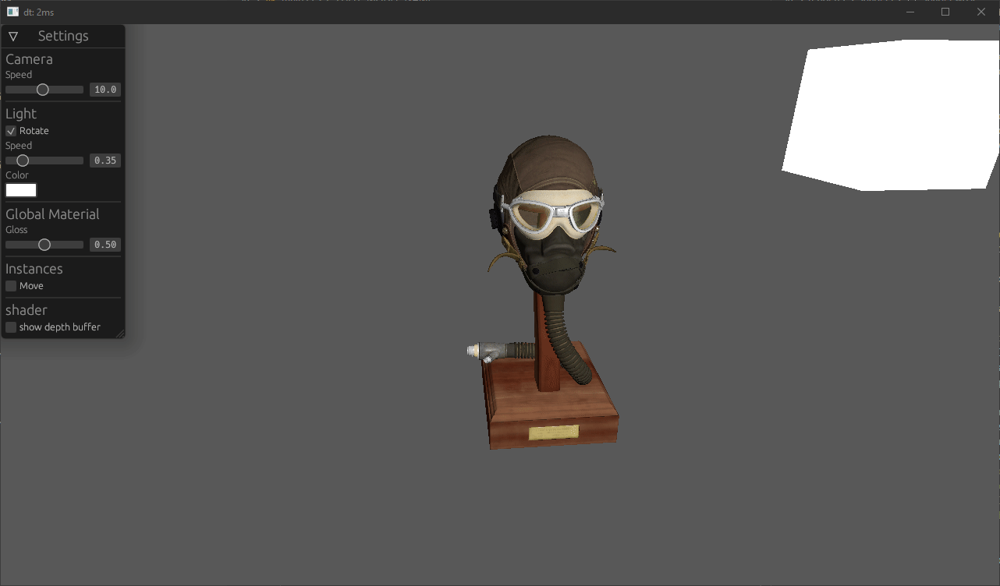

# glace

This is a toy renderer using rust to learn wgpu and computer graphics built with bevy.

It can also be used to showcase integrating a custom renderer to bevy.

## Features

* Basic Blinn-Phong shading
* Normal mapping
* Specular mapping
* Instanced rendering
* Load obj
* Partially load gltf
* egui integration
* 3d camera controller

## TODOs

* MSAA
* Use bevy log plugin and tracing
* Use bevy mesh and material abstractions
* PBR
* Clustered forward rendering
* Better sorting for transparent phase
* Use gltf blend mode
* GI???
* Weighted blended order independent transparency
* Cel shading
* Bindless rendering
* Split plugins to separate crates for better compile times
